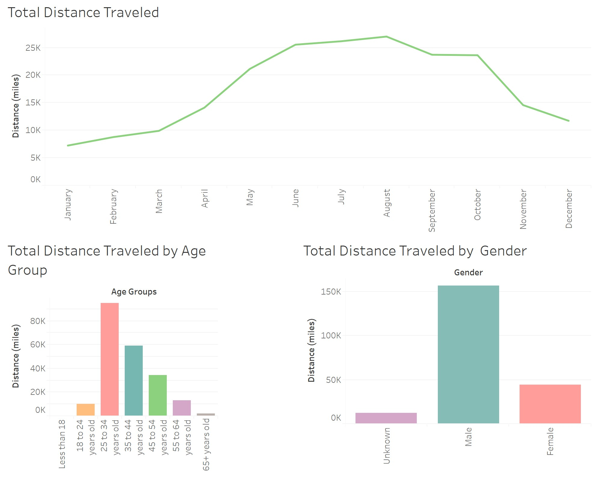

# Citi Bike Analytics

**The popularity of a Starting or an Ending stations is indicated by the size of its marker. The larger the marker the more popular a station is. In these vizualizations popularity is defined by the total number of trip records the station had in 2018. The color of each marker show the median age of the riders at the starting and ending stations. An interesting observation is that the popular stations are located between Jersey City and the Hudson River. Also the median age of riders at the most popular starting and ending station is 36.**

** **

****
